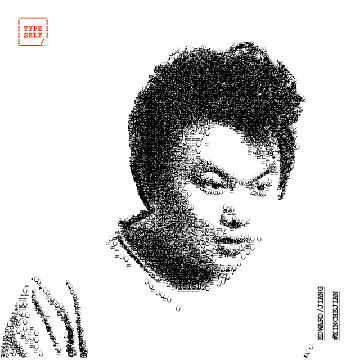

Edward Jiang
============
+86 13039007723 - edwardrf@gmail.com 
https://github.com/edwardrf/

Ability to learn is the key strengh for software developers
-----------------------------------------------------------

### Coder/Developer/Tech Lead/Hacker
* Experienced Software Developer
* Good understanding of software development workflow and team management
* Familiar with the web and mobile stack of technology, from cloud, container technology, databases, backend, front-end and all the way to js and css
* Interested in following the progress of cutting edge software technology and eager to practice them in real life project
* Stakeholder of the first Hackerspace in Shanghai XinCheJian

Skills
------
* Familiar with various popular programming languages: c/c++, java, js (Node.js), golang, lua, python
* Excellent skills and deep understanding of web technology: HTML5, javascript, css
* Experienced with databases, indexing engines: MySQL, PgSQL, Redis, DynamoDB etc
* Very familiar with open source technology: Linux, Nginx, Apache, Docker, Git etc
* Good understanding and basic experience developing with IM platforms (WeChat, Telegram)

Projects
--------
* [Xtremax Pte Ltd (Singapore)](http://www.xtremax.com/) 
  * Email and SMS campaign management system using J2EE technology. Achieves simple WYSIWYG editor in web browser in a pre-jQuery, pre-web-framework era.
  * Working with various opensource and proprietary CMS systems and provide both front-end and backend customization.
  * Manage all physical servers in datacenter, created virtual server cluster environment with VMware virtualization technology. And later migrated some of the services to AWS cloud.
* [Tradesparq.com](www.tradesparq.com):
  * Manage the development and product team
  * Architect the product from a site with a few hundred users to a platform with a few hundred thousand user with TBs of data and indexes
  * Evolve the front-end technology from simple jquery to full angularjs web application through several generations of upgrade
  * Update the backend technology from a single server php site, to containerized cloud based API and services utilizing Node.js, PHP, Golang, deployed in AWS.
  * Develop backend tools to facilitate and monitor the smooth running of the site, focused on automated testing, deployment and real time monitoring

* Typeself: Converted a old school typewriter to type out images [http://www.typeself.cc](http://www.typeself.cc)
This project has 2 main challenges, the algorithm to generate the character map which would be physically type out to be a picture, and using HTML and js to create the website to generate a fast enough animation using the exact font the typewriter has.
* Autonomous Sofa: An artist installation project which created an autonomous sofa returns to its original position and obstacle avoidance with only simple sensors.(杨振中-请坐) [Exhibition site: http://bit.do/asofa](http://bit.do/asofa) [http://bit.do/ysofa](http://bit.do/ysofa)
Creating an navigation algorithm with limited sensor input with considerable amount of noise is very challenging especially debugging involves hardware in the loop.
* Led and Lamp Matrix: Created small 8x8 led matrix as well as a 8x8 IKEA lamp matrix that does animation and can be controlled over the internet

* Designed simple analog line follower robot with simple discrete analog components. [http://bit.do/linef](http://bit.do/linef) [http://bit.do/linew](http://bit.do/linew)
* High performance api log processing and event distribution system using golang. Implementing anomaly detection and cooperate with various 3rd party services

Qulifications
-------------
* Bachelor of Science with Merit on 30th June 2008. Major in Computational science (specialising in physics)
* GCE 'A' Levels
* GCE 'O' Levels

Related Awards
--------------
* 2002 National Olympics of Informatics (Singapore) Silver Medal
* 2003 National Olympics of Informatics (Singapore) Gold Medal
* 2003 National Software Competition (Singapore) 2nd Runner Up 

Learning Experience
-------------------
* Early access to computer since primary school, as grandfather is the first generation of computer scientist
* Self taught BASIC programming
* Left China and took government scholarship to Singapore for studies at age of 16
* Started part-time working at Xtremax during Junior college and University
* Exposed to early web programming using java by doing J2EE web applications and websites
* Graduated from National University of Singapore, Major in Computational Physics, first hand experience with high performance computing and parallel computing
* Student exchange to Université Pierre-et-Marie-Curie (Paris VI)
* Currently working on an opensouce VPN https://github.com/jingqiuELE/tinyvpn

Language Skills
---------------
* Native Chinese speaker
* Excellent English
* Basic French

Work Experience
---------------
#### Xtremax Pte Ltd (Singapore) (2001 ~ 2009)
* Started as part time job while still in Junior College and university (2001 ~ 2006)
* Joined full time as System Analyst, then became System Architect (2006 ~ 2009)

#### Tradesparq Ltd (Shanghai) (2009 ~ 2016)
* Joined as Team Lead in 2009
* Expanded the team from 3 people to 12 and became the CTO in 2014

#### Free lancing (Shanghai) (2016 ~ now)
* [italki](www.italki.com) Technical consulting and Implementing log processing and online chatting system in golang.
* [Westwell Labs](http://www.westwell-lab.com/index_en.html) Vairous projects including constructing autonoous robot platform.
* Various works with international advertising agencies implementing projects combining software and hardware.

Beliefs
-------
* Measure twice and cut once
* Less is more: Simple, clean, testable code with clear comments
* vim is the text editor

An up-to-date online copy cannot be found at https://github.com/edwardrf/resume/blob/master/software.md
