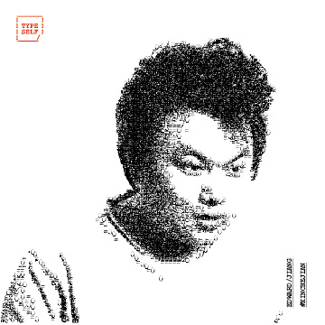
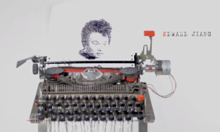

Edward Jiang
============
+86 13039007723 - edwardrf@gmail.com

###Coder/Hacker/Tech enthusiast
* Experienced Software Developer
* Loves hacking with both software and hardware, combine them to create interesting and useful things
* Follow closely with the development of new technology in software and hardware

Skills
------
* Familiar with various popular programming languages: c/c++, java, js, golang, lua, python
* Excellent skills and deep understanding of web technology: HTML5, javascript, css
* Expert with Arduino, Digital Electronics and basic Analog Electronics
* Electronic circuit design, PCB design
* Robot building, working with sensors, motors, servos
* Good understanding and experience of Airplane and Multi-rotor-copters (Drones)

Projects
--------

* Typeself: Converted a old school typewriter to type out images [http://www.typeself.cc](http://www.typeself.cc)
* Autonomous Sofa: An artist installation project which created an autonomous sofa returns to its original position and obstacle avoidance with only simple sensors.(杨振中-请坐) [Exhibition site: http://bit.do/asofa](http://bit.do/asofa) [http://bit.do/ysofa](http://bit.do/ysofa)
* Led and Lamp Matrix: Created small 8x8 led matrix as well as a 8x8 IKEA lamp matrix that does animation and can be controlled over the internet

* Autonomous robot car: obstacle avoidance using laser and camera to participate in xinchejian autonomous car competition
* Designed simple analog line follower robot with simple discrete analog components. [http://bit.do/linef](http://bit.do/linef) [http://bit.do/linew](http://bit.do/linew)
* Model airplane and drone building: 2nd place in shanghai bosch drone competition

Academic
--------
* Left China and took government scholarship to Singapore for studies at age of 16
* Graduated from National University of Singapore, Major in Computational Physics
* Student exchange to Université Pierre-et-Marie-Curie (Paris VI)

Language Skills
---------------
* Native Chinese speaker
* Excellent English
* Basic French

Work Experience
---------------
####Xtremax Pte Ltd (Singapore) (2001~2009)
Started as part time job while still in Junior College and university (2001~2006)
Joined full time as System Analyst, then became System Architect (2006~2009)

####Tradesparq Ltd (Shanghai) (2009~2016)
Joined as Team Lead in 2009
Expanded the team from 3 people to 12 and became the CTO in 2014

Beliefs
-------
* Measure twice and cut once
* Less is more: Simple, clean, testable code with clear comments
* Safety factor of 3.0 is a bare minimum
* vim is the text editor
